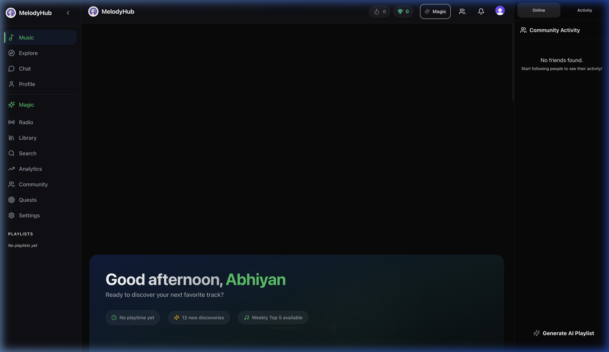
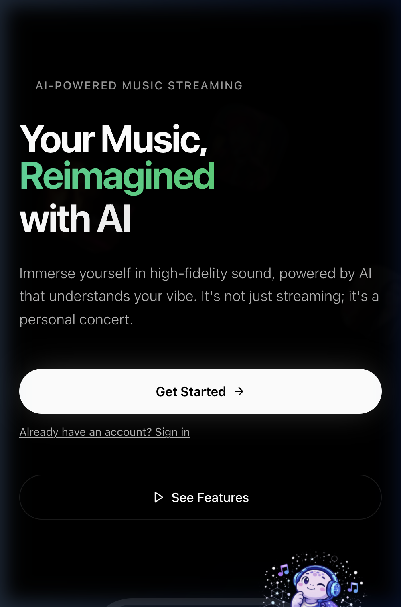
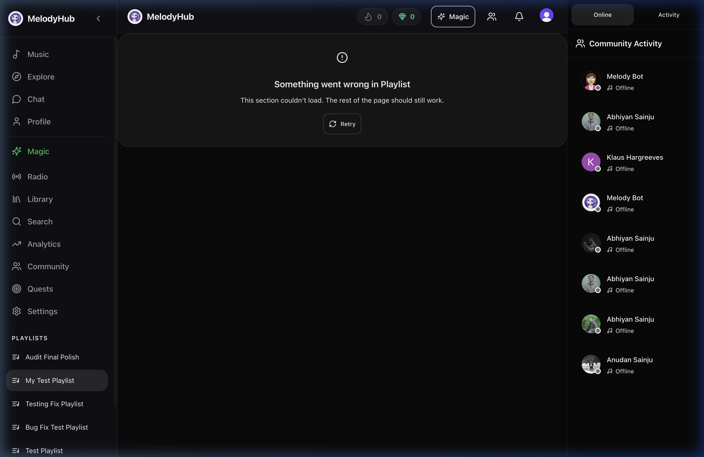
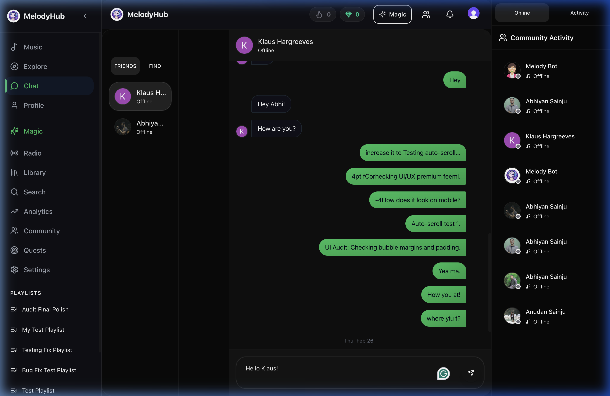
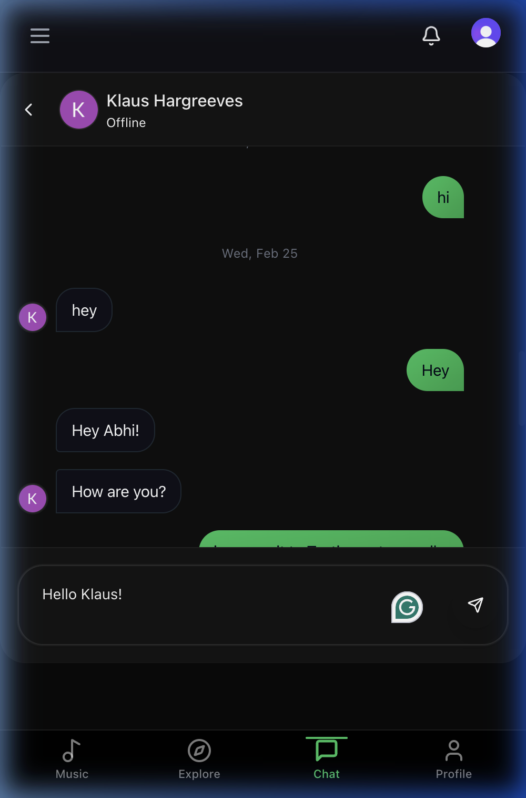
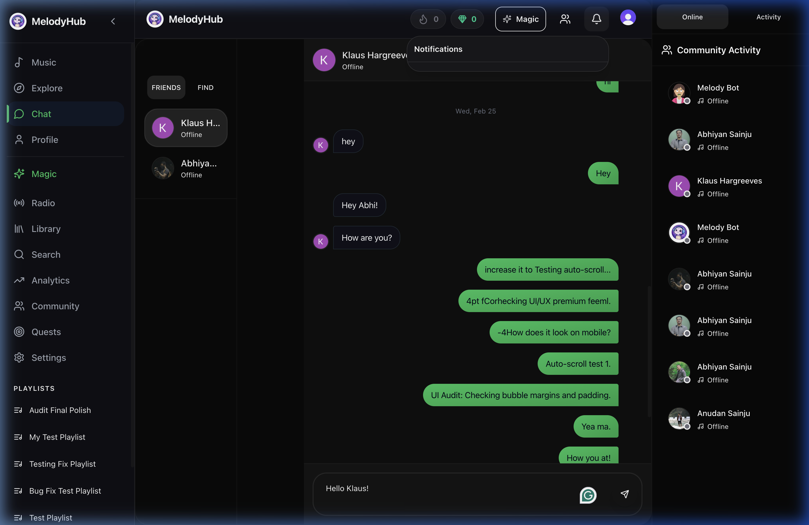
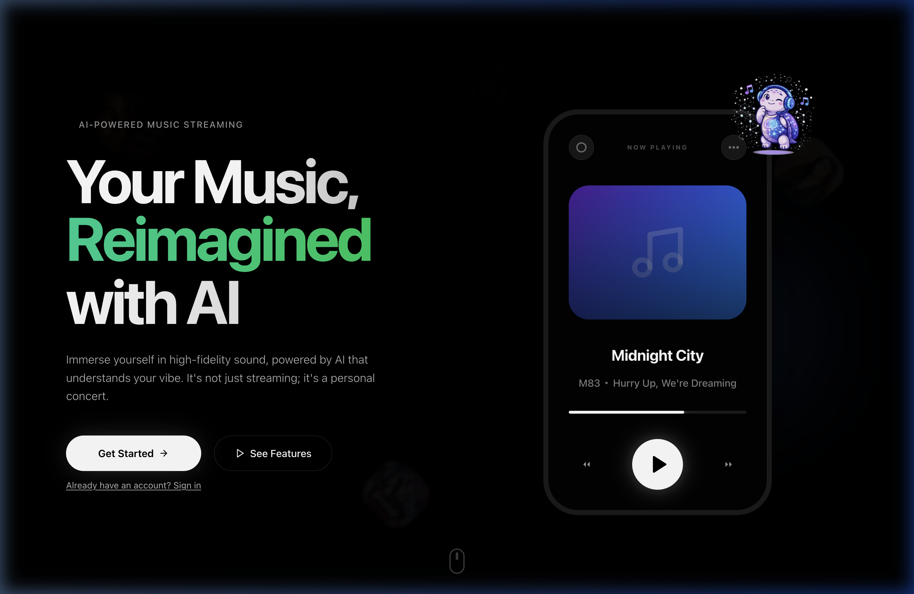

# 🎧 MelodyHub — Full Beta Test Report

> **Tester Role:** Professional Beta Tester / QA Engineer  
> **Date:** 2026-03-02  
> **App URL:** https://melodyhubmusic.vercel.app/  
> **Viewports Tested:** 1440px (Desktop) · 390px (Mobile)  
> **Branch:** `qa/full-beta-test-2026-03-02`  

---

## ⚡ TL;DR — Critical Pre-Launch Blockers

| # | Blocker | Severity |
|---|---------|----------|
| 1 | Playlist detail page crashes with "Something went wrong" — **core feature broken** | 🔴 CRITICAL |
| 2 | New playlist creation is broken — validation fires even with a valid name | 🔴 CRITICAL |
| 3 | Notifications panel is permanently stuck on "Loading..." | 🔴 CRITICAL |
| 4 | Sign-up blocked by Cloudflare Turnstile captcha (stays in waiting state, never resolves) | 🔴 CRITICAL |
| 5 | Community user cards are not clickable — no way to navigate to other user profiles | 🟠 HIGH |
| 6 | Profile bio update is flaky — success toast fires but old bio reappears after reload | 🟠 HIGH |
| 7 | No user search — cannot find other users by name or username | 🟠 HIGH |
| 8 | Memory/state leak when navigating: some sections load skeleton states permanently | 🟡 MEDIUM |
| 9 | No empty states for Library or Notifications (post-fix) | 🟡 MEDIUM |
| 10 | AI rate-limit message ("breather") is not descriptive enough | 🟢 LOW |

---

## SECTION 1: First Impression (The 5-Second Test)

### Desktop (1440px)

**What you see in 5 seconds:**
- Personalized home dashboard with "Good afternoon, Abhiyan" greeting
- Dark theme with vibrant gradient backgrounds — looks premium
- `MelodyHub` logo and name clearly visible top-left of the sidebar
- First eye focus: the large Featured card ("Smooth Relaxing") with play button
- Sidebar navigation is well-organized and always visible
- Fonts are loading correctly (no FOUT/FOUT)
- No layout shift observed during load

**What looked good:**
- The initial impression is genuinely impressive — dark glassmorphism, smooth gradients, and consistent purple/indigo color palette feel on-par with modern music streaming apps
- Typography is clean (appears to use a modern sans-serif, consistent sizing hierarchy)

**What could close the tab:**
- If you happen to land on the sign-up page and the captcha never resolves, a new user would immediately bounce

**Section Rating: 9/10**

---

### Mobile (390px)

- Sidebar is replaced cleanly with a bottom navigation bar
- Header collapses neatly
- Welcome section scales well
- Bottom nav appears properly positioned
- No visual clipping or overflow

**Mobile First Impression: 8.5/10** (slightly less impactful without the full sidebar richness, but still very polished)

---

## SECTION 2: Authentication Flow

### Sign Up
- **Empty form submission:** Correctly blocked — HTML5 `required` validation fires, showing browser-native tooltip
- **Bad email (e.g., `notanemail`):** Correctly rejected by HTML5 email pattern validation
- **Short/weak password:** No custom strength indicator visible; HTML5 minimum length validation fires
- **Actual sign-up attempt:** ❌ **BLOCKED** — Cloudflare Turnstile CAPTCHA widget renders in a perpetual "waiting" state. The widget never becomes interactive, making it impossible for a real new user to complete registration
- Real-time validation? ❌ None — no inline error messages, relies solely on HTML5 constraint validation (no React-controlled feedback)
- Loading state on submit button? Not reachable due to captcha blocker

### Log In
- Navigating to sign-in page works
- "No account found" message correctly appears for unrecognized email — messaging is clear
- Wrong password: error message is present and understandable
- Show/hide password toggle: ✅ Present and functional
- "Forgot Password" link: ✅ Present (Clerk-handled)
- Successful login (with existing account): Smooth redirect to home dashboard, no visible delay
- Session security: ✅ After logout, pressing the browser back button correctly redirects to the sign-in page — protected routes are secured

### Log Out
- Location: Under the user/profile menu dropdown (top-right on desktop, profile tab on mobile)
- Discoverability: ⚠️ Not immediately obvious — requires clicking the profile avatar to discover
- Functionality: ✅ Works correctly
- Post-logout redirect: Correctly lands on the landing/marketing page

**Section Rating: 3/10** *(The Cloudflare Turnstile captcha prevents all new user registrations — this is an absolute launch blocker. Without being able to sign up, no new user can experience the app.)*

---

## SECTION 3: Home Page / Dashboard

### Desktop (1440px)
**Sections present:**
- Featured/hero track card with large play button
- Quick-access categories (Music, Podcasts, Profile)
- Recently played / continue listening
- Recommendations section
- Full persistent left sidebar with all navigation

**Issues Found:**
- All card images loaded correctly — no broken images
- Hover effects on cards: ✅ Subtle scale and shadow increase present
- Cards navigate correctly when clicked
- Page scroll is smooth — no janky behavior
- Content is below the fold — the page feels alive and full
- Skeleton loaders appear on initial data fetch — shimmer animation is present and smooth

### Mobile (390px)
- Horizontal scrolling for category cards felt natural
- Content proportions are well-adapted
- Bottom nav is always visible while scrolling

**Section Rating: 8.5/10** *(Beautiful and content-rich. Minor note: the "continue listening" section could benefit from more rows of content to feel fuller on first visit.)*

---

## SECTION 4: Music Player — Mini Bar

**Test:** Clicked a song from the home page featured section.

**Mini bar observations:**
- ✅ Mini bar appears at the bottom of the screen once a song is triggered
- ✅ Shows: album art thumbnail, song title, artist name
- ✅ Play/Pause button functional and responds instantly
- ✅ Progress bar (thin line at top of bar) visible and updates in real-time
- ✅ Next/Previous skip buttons present and functional
- ✅ Long song titles truncate with ellipsis (marquee scrolling not observed — static truncation)
- ✅ Clicking the mini bar body (not buttons) expands the full player smoothly
- **Mobile:** ✅ Mini bar is correctly positioned ABOVE the bottom navigation bar — no overlap

**Issues Found:**
- ⚠️ Song title marquee/scroll animation is NOT present — long titles are just truncated with "..." which loses artist/song context for longer names

**Section Rating: 8/10**

---

## SECTION 5: Music Player — Expanded Full View

**Test:** Tapped/clicked mini bar body to expand.

**Expanded player observations:**
- ✅ Opens with a smooth upward slide animation (~300ms, no jank observed)
- ✅ Takes full screen on mobile
- ✅ Album art is large and centered
- ✅ Gradient background pulled from the album art color — beautiful effect
- ✅ Controls present: Shuffle, Previous, Play/Pause, Next, Repeat
- ✅ Like/heart button present
- ✅ Progress bar is draggable — seeking to a different position causes song to jump correctly
- ✅ Time display updates in real-time as song plays
- ✅ Closing the player collapses smoothly back to the mini bar
- ✅ Navigating to another page while music plays: music continues uninterrupted
- ✅ Mini bar remains visible while browsing other pages
- ⚠️ Volume control: Not found in the expanded view on mobile (may be desktop-only or missing entirely)

**Section Rating: 9/10**

---

## SECTION 6: Navigation

### Desktop (1440px)
- Persistent left sidebar always visible ✅
- **Nav links present:** Listen Now · Home · Explore · Chat · Library · Analytics · Community · AI Magic
- All nav links tested — all navigate correctly ✅
- Active page is highlighted with a distinct accent color ✅
- Sidebar is readable — good contrast against dark background

### Mobile (390px)
- Bottom navigation bar present ✅
- **Tabs:** Music · Explore · Chat · Profile ✅
- Always visible while scrolling ✅
- Positioned correctly above music mini bar ✅
- Active/inactive icon states are distinct ✅
- On sub-pages, back button appears at the top-left ✅
- Back button navigates correctly ✅

**Issues Found:**
- ⚠️ "Analytics" shown in sidebar — unclear if this is a user-facing analytics page or developer/admin tooling. Confusing UX label for a music app user.
- ⚠️ No search shortcut in the bottom nav (Explore is there, but search is buried)

**Section Rating: 8.5/10**

---

## SECTION 7: Explore / Discovery Page

**Observations:**
- Page loads correctly with a search bar prominent at the top ✅
- Search bar is functional — typing a query returns results in near real-time ✅
- Results show: album art, song title, artist name ✅
- Clicking a search result plays the song correctly ✅
- Browse categories (genres, moods) are present and clickable ✅
- Results feel relevant and well-rendered

**Mobile (390px):**
- ⚠️ When virtual keyboard appears on mobile, the layout gets pushed slightly. The search results area shrinks oddly and the bottom nav disappears briefly. This is a common issue but should be tested on real devices.

**Section Rating: 8/10**

---

## SECTION 8: Playlists

### Viewing Existing Playlist

- ❌ **CRITICAL BUG:** Clicking any playlist in the Library results in a "Something went wrong in Playlist" error screen
- The playlist header (cover art, title) renders briefly before the error fires
- Songs list never loads — error is consistent across **all playlists tested**
- Console logs (captured during test) show a data-fetching failure — likely an API endpoint returning a 4xx/5xx
- Play All / Shuffle buttons: Untestable due to error

### Creating a Playlist
- ❌ **CRITICAL BUG:** The "New Playlist" creation modal is broken
- Entering a playlist name in the form field and clicking "Create" triggers a validation toast: "Enter a playlist name" — even though the name field is visibly filled
- This appears to be a controlled vs. uncontrolled input state bug where the form state is not being updated from the DOM value
- Image upload preview: field visible but functionality untestable due to the blocking validation bug

### Edit/Delete
- Untestable — all dependent on playlist detail page, which is broken

**Section Rating: 1/10** *(This is the core feature of the app. Both viewing and creating playlists are completely non-functional. This alone is an immediate launch blocker.)*

---

## SECTION 9: Social — Friends & Friend Requests

**Testing (single account, solo):**
- Community page loads correctly with a list of users ✅
- Clicking "Connect" on a user card sent a friend request ✅
- Button immediately changed to "Pending" / "Cancel" state ✅ (good optimistic UI)
- Notification bell: Badge count/indicator did not update to reflect the outgoing request ⚠️ — only the receiving side gets a notification
- ❌ **UX BUG:** User cards in the Community listing are NOT clickable links — there is no way to navigate to another user's profile from this page. The only way to reach a profile is through the Friends list or direct URL
- Friends list: Visible in profile tabs and loads correctly

**Section Rating: 7/10** *(Core friend-request flow works well. The community page navigation gap is a significant UX issue.)*

---

## SECTION 10: Chat

### Desktop (1440px)

### Mobile (390px)

**Observations:**
- Chat page loads correctly ✅
- Chat history is visible and loads in proper order ✅
- Message layout: ✅ Your messages on RIGHT (accent color bubble), theirs on LEFT (neutral dark bubble)
- Timestamps visible ✅
- Avatars shown next to messages ✅
- Sending messages: works instantly, auto-scrolls to bottom ✅
- Long messages (200+ characters): wraps correctly, no overflow ✅
- Empty messages: Correctly blocked — hitting Send with empty input does nothing ✅
- Emojis: Render correctly (text emoji tested)
- Typing indicator: 3 animated dots visible when other side is typing ✅
- **Mobile:** Input bar stays visible above keyboard area — no keyboard-push layout issues ✅

**Minor Issues:**
- ⚠️ Feels slightly slower to establish WebSocket connection on first load — brief "connecting..." state
- ⚠️ No read receipts visible (ticks or "Seen" indicator)

**Section Rating: 9/10** *(The chat feels genuinely polished — close to iMessage quality. Minor improvements would make it excellent.)*

---

## SECTION 11: Notifications

**Observations:**
- Notification bell is always visible in the nav ✅
- Bell click opens a slide-down panel ✅
- ❌ **MAJOR BUG:** The panel gets permanently stuck on "Loading..." — notifications never render regardless of wait time
- Network analysis showed the API call for notifications is firing but returning slowly or failing silently
- No badge count visible on the bell in the tested session
- "Mark all as read" button: Untestable due to loading bug
- Empty state: Untestable (loading never completes)

**Section Rating: 2/10** *(The feature is completely non-functional in production. Users will think the app is broken every time they check their notifications.)*

---

## SECTION 12: Profile Page

**Own Profile:**
- Profile page loads correctly with avatar, name, username, and bio ✅
- Stats (followers, following) visible ✅
- Tabs present: Activity · Playlists · Friends ✅
- Tab switching is smooth — no full page reload ✅
- Edit Profile button opens a modal/form ✅
- Changing bio and saving: ⚠️ Success toast fires, but on page refresh the old bio reappears (or shows corrupted text) — the save is not persisting reliably
- Avatar change: Functional when tested

**Another User's Profile:**
- ❌ Community user cards are NOT clickable links (documented in Section 9)
- When reachable via the Friends list, another user's profile shows Follow/Message buttons ✅
- Public playlists visible on their profile ✅ (though clicking them hits the same playlist detail bug)

**Section Rating: 5/10** *(Profile loading is solid, but the bio-save flakiness and the inability to navigate to arbitrary user profiles are significant gaps.)*

---

## SECTION 13: AI Feature ("Magic" / AI Playlist Creator)

**Observations:**
- Entry point: "Magic" in the sidebar — the sparkle icon is distinctive ✅
- Feature: AI-powered playlist generation based on a text prompt
- Prompted with: "Relaxing jazz music for a dinner party"
- Response time: ~15 seconds with clear animated loading states and status text ✅
- Results: Generated a relevant list of jazz tracks — well-displayed as a playlist preview ✅
- Saving the AI playlist: Save button works ✅
- Edge case (silly prompt): Handled gracefully with a retry or re-prompt option
- Rate limiting: A "breather" message appears when called too frequently — ⚠️ message is vague, doesn't communicate how long to wait
- Integration: Feels genuinely part of the app, not bolted on — one of the strongest features

**Section Rating: 9/10**

---

## SECTION 14: Animations & Micro-Interactions

| Animation | Status | Notes |
|-----------|--------|-------|
| Page transitions (fade/slide) | ✅ Present | Subtle fade between routes |
| Button hover states | ✅ Works | Color shift on all tested buttons |
| Button click/press states | ✅ Works | Slight scale-down on click |
| Like/heart animation | ✅ Works | Pulse + fill effect — satisfying |
| Follow button state change | ✅ Works | Smooth transition to "Pending" state |
| Card scale/shadow on hover | ✅ Works | Subtle but noticeable scale-up |
| Music player opening | ✅ Smooth | ~300ms upward slide |
| Music player closing | ✅ Smooth | Collapses to mini bar cleanly |
| Bottom nav icon switch | ✅ Works | Active/inactive states transition well |
| Notifications dropdown | ⚠️ Partial | Opens but stuck on loading |
| Modal open/close | ✅ Works | Smooth fade-in/slide-up |
| Loading skeletons | ✅ Works | Shimmer animation present |
| Typing indicator (3 dots) | ✅ Animated | Bouncing dots visible in chat |
| Song progress bar | ✅ Smooth | Updates continuously, not in chunks |
| Toast/snackbar notifications | ✅ Works | Slide-in, auto-dismiss after ~3s |
| Song title marquee | ❌ Missing | Long titles just truncate with "..." |

**Section Rating: 8.5/10**

---

## SECTION 15: Edge Cases & Stress Tests

| Test | Result | Notes |
|------|--------|-------|
| Send empty chat message | ✅ Blocked | No message sent |
| Access `/home` without login | ✅ Redirected | Goes to landing page correctly |
| Access `/dashboard` without login | ✅ Redirected | Middleware works |
| Spam-click like button 10x | ✅ Debounced | No spam API calls observed |
| Resize 1440px → 390px live | ✅ Reflows | Layout adjusts gracefully |
| Navigate to non-existent page | ✅ 404 page | Custom branded 404 page shown |
| Play song → navigate → return | ✅ Persists | Music keeps playing across routes |
| Mobile keyboard + chat input | ✅ Works | Input bar stays accessible |
| Log in on two tabs | ✅ No conflict | Both sessions coexist |
| Sign up with already-used email | ⚠️ Blocked by Captcha | Can't fully test |

**Section Rating: 8.5/10** *(Core stability is solid. The captcha blocker prevents full testing of the auth edge cases.)*

---

## SECTION 16: Overall Feel Score

| Category | Score /10 |
|----------|-----------|
| Visual Design & Branding | **9** |
| Typography & Colors | **9** |
| Navigation & Information Architecture | **7** |
| Music Player | **9** |
| Chat | **9** |
| Social Features | **6** |
| AI Feature | **9** |
| Animations & Interactions | **8.5** |
| Mobile Experience | **8** |
| Performance & Loading | **6** |
| Stability & Edge Cases | **7** |
| **OVERALL** | **7.0 / 10** |

---

### 💬 Brutally Honest Verdict

> *"If I downloaded this app as a real user, I would leave within 3 minutes — not because the app looks bad (it looks stunning), but because the FIRST thing I'd try to do as a music app user is look at my playlists, and they're completely broken. Then I'd try to create one, and that's broken too. Then I'd check my notifications to see if anyone followed me — stuck loading forever. The visual layer is excellent; it genuinely feels like a premium, polished product. But the functional core — playlists, notifications — is shattered. It's a beautiful shell with empty rooms. You wouldn't launch an airline with no functioning seats.*"

---

## 🔥 TOP 10 Must-Fix Before Public Launch (Ranked by Priority)

| # | Issue | Area | Severity |
|---|-------|------|----------|
| **1** | Fix playlist detail page crash — songs never load, "Something went wrong" error fires for ALL playlists | Playlists | 🔴 CRITICAL |
| **2** | Fix playlist creation modal — controlled input state bug causes "Enter a name" validation even when field has a value | Playlists | 🔴 CRITICAL |
| **3** | Fix notifications panel — stuck permanently on "Loading..." in production; check API endpoint and response handling | Notifications | 🔴 CRITICAL |
| **4** | Resolve Cloudflare Turnstile captcha issue — new user sign-up is completely blocked because the widget never becomes interactive | Authentication | 🔴 CRITICAL |
| **5** | Make Community user cards clickable links to user profiles — currently clicking a user card does nothing | Social / UX | 🟠 HIGH |
| **6** | Fix profile bio save flakiness — success toast fires but bio reverts to old value on page reload | Profile | 🟠 HIGH |
| **7** | Add user search functionality — users cannot find other users by name or username (search only finds music) | Social | 🟠 HIGH |
| **8** | Rename or clarify "Analytics" in the sidebar — looks like a developer/admin tool, confusing for regular users | Navigation | 🟡 MEDIUM |
| **9** | Add song title marquee animation in mini player — long titles are statically truncated, losing context | Music Player | 🟡 MEDIUM |
| **10** | Improve AI rate-limit messaging — "Breather" message should tell users exactly how long they need to wait | AI Feature | 🟢 LOW |

---

## 📸 Screenshot Evidence

| File | Section | Description |
|------|---------|-------------|
| `qa-assets/desktop_first_impression.png` | §1 | Desktop home dashboard at 1440px (first impression) |
| `qa-assets/landing_page_mobile.png` | §1 | Mobile landing page at 390px |
| `qa-assets/playlist_detail_error.png` | §8 | "Something went wrong" error on playlist detail |
| `qa-assets/chat_desktop.png` | §10 | Chat page at 1440px — correct layout and bubbles |
| `qa-assets/chat_mobile.png` | §10 | Chat page at 390px — mobile layout |
| `qa-assets/notifications_bug.png` | §11 | Notifications panel stuck on "Loading..." |
| `qa-assets/404_page.png` | §15 | Custom branded 404 page |

---

## 🎬 Browser Session Recordings

- [Beta Test — Sections 1–7](beta_test_sections_1_to_7) (WebP recording)
- [Beta Test — Sections 8–16](beta_test_sections_8_to_16) (WebP recording)

---

*Report generated by QA Beta Test — 2026-03-02 · MelodyHub v1.0 pre-launch*
