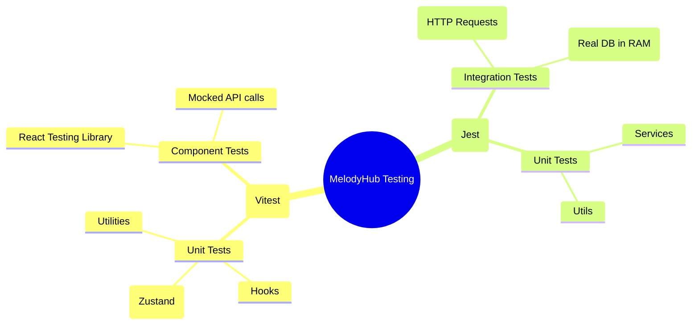

# Testing Architecture Deep Dive: MelodyHub

> **Goal**: Validate that your code works now and won't break later.
> **Philosophy**: "Test behavior, not implementation details."

## 1. The "Big Picture" Architecture

We use a **Testing Pyramid** strategy. This means we have many fast, isolated unit tests and fewer, slower integration tests.

---

## 2. The Tech Stack (The "What")

| Layer | Tool | Why we chose it? |
| :--- | :--- | :--- |
| **Frontend Runner** | **Vitest** | It uses the same specific configuration as Vite (our build tool), making it 10x faster than Jest for frontend. |
| **Frontend UI** | **React Testing Library** | It forces you to test like a user ("Click button", "Read text") rather than implementation ("Check state variable `isLoading`"). |
| **Backend Runner** | **Jest** | The industry standard for Node.js. Mature, huge ecosystem, and great mocking capabilities. |
| **API Testing** | **Supertest** | Allows us to send fake HTTP requests to our Express app without actually starting the server on a port. |
| **Database** | **MongoMemoryServer** | Spins up a *real* MongoDB instance in RAM. This ensures our tests are accurate without polluting our development database. |

---

## 3. The "Why" (Design Decisions)

### Q: Why `MongoMemoryServer` instead of mocking Mongoose?
**Decision**: We chose **Integration** over **Unit** for the backend API.
*   **Mocking Example**: `User.find = jest.fn().mockReturnValue([])`.
    *   *Pro*: Fast.
    *   *Con*: Usefulness is low. You aren't testing if your Mongoose query is valid, only if your controller handles an empty array.
*   **Our Approach**: Spin up a real DB in memory (MongoDB Memory Server).
    *   *Why*: We want to know if saving a user *actually* saves it. If we use a wrong Mongoose schema, the test will fail. Mocks would hide that bug.

### Q: Why Vitest instead of Jest for Frontend?
**Decision**: Shared configuration.
*   We use Vite to build the app. Jest requires a complex separate compilation step (Babel/ts-jest) to understand TypeScript.
*   Vitest reads `vite.config.ts` natively. It "just works" and works natively with ESM modules (`import`/`export`), avoiding common "Cannot use import outside a module" errors.

---

## 4. The "How" (Code Walkthrough)

### Backend: The Integration Test Flow
File: `backend/src/__tests__/auth.integration.test.ts`

1.  **Setup (`beforeAll`)**:
    *   Calls `MongoMemoryServer.create()`.
    *   Mongoose connects to this temporary `mongodb://127.0.0.1:xxxx/test` URI.
2.  **Execution (`it`)**:
    *   `request(app).post('/api/auth/callback')` sends a mocked HTTP request.
    *   The Express app handles it *exactly* like production.
    *   It tries to save to the DB.
3.  **Verification (`expect`)**:
    *   We check `res.status` (HTTP Layer).
    *   **Crucially**, we query the DB directly: `User.findOne(...)`. This confirms the data actually persisted.
4.  **Teardown (`afterEach`)**:
    *   `clearDatabase()` wipes all data so the next test is clean.

### Frontend: The Component Mocking Flow
File: `frontend/src/pages/__tests__/SearchPage.test.ts`

1.  **Mocking Dependencies**:
    *   We don't want to hit the real API or the real router.
    *   `vi.mock('@/stores/MusicStore')`: We replace the complex logic store with a simple fake version that returns strict data we control.
2.  **Rendering**:
    *   `render(<SearchPage />)`: Builds the DOM in memory (`jsdom`).
3.  **Interaction**:
    *   `userEvent.type(input, 'Hello')`: Simulates real typing.
4.  **Assertion**:
    *   `expect(screen.getByText('Hello World')).toBeInTheDocument()`: Checks the final HTML output.

---

## 5. "How do I build this from scratch?"

If you were in a blank folder, here is the sequence:

### Backend
1.  **Install**: `npm install -D jest supertest mongodb-memory-server @types/jest ts-jest`
2.  **Config (`jest.config.ts`)**: Tell Jest to use `ts-jest` to understand TypeScript.
3.  **Setup Helper**: Write the `tests/utils/setup.ts` to handle the `MongoMemoryServer` connection logic.
4.  **Write Test**: Create `__tests__/my.test.ts`.

### Frontend
1.  **Install**: `npm install -D vitest jsdom @testing-library/react @testing-library/user-event`
2.  **Config (`vitest.config.ts`)**: Add `environment: 'jsdom'` (simulates a browser so `document.getElementById` works).
3.  **Write Test**: Create `__tests__/Button.test.tsx`.

---

## 6. Alternatives We Rejected

*   **Cypress (for everything)**: Too slow. Running a full chrome browser for every single button test would take hours. We reserve this for "Critical User Journeys" (future step).
*   **Enzyme**: Deprecated. It tested implementation state (`component.state('isOpen')`), which makes refactoring hard. We use React Testing Library instead.
