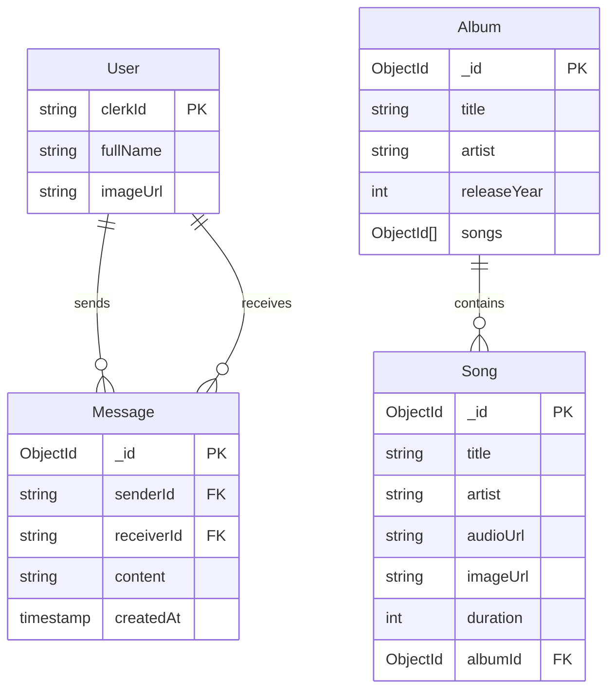

# System Design Document (SDD): MelodyHub

**Status**: Draft  
**Version**: 1.0  
**Author**: System Architect  

## 1. High-Level Architecture (C4 Context)
MelodyHub follows a **Client-Server Architecture** with a real-time event layer.

```mermaid
graph TD
    User[User / Listener]
    Admin[Administrator]
    
    subgraph MelodyHub System
        WebApp[Frontend Web App\n(React + Zustand)]
        API[Backend API\n(Express + Node.js)]
        Socket[Socket Service\n(Socket.io)]
    end
    
    DB[(MongoDB Atlas\nPrimary Database)]
    Cloudinary[Cloudinary\n(Media Storage)]
    Clerk[Clerk Auth\n(Identity Provider)]

    User -->|HTTPS| WebApp
    Admin -->|HTTPS| WebApp
    
    WebApp -->|REST JSON| API
    WebApp -->|WebSockets| Socket
    
    API -->|Read/Write| DB
    API -->|Verify Token| Clerk
    API -->|Upload/Stream| Cloudinary
```

## 2. Container Architecture
Detailed view of the application internals.

### 2.1 Frontend Container
-   **Technology**: React 19, Vite, TailwindCSS.
-   **Responsibility**: Rendering UI, managing playback state, handling user input.
-   **State Management**: `Zustand` stores (UserStore, PlayerStore, ChatStore).

### 2.2 Backend Container
-   **Technology**: Node.js, Express, TypeScript.
-   **Responsibility**: Business logic, data validation, database orchestration.
-   **Layers**:
    -   `Routes`: Entry points (e.g., `/api/songs`).
    -   `Controllers`: Request/Response handling.
    -   `Services`: Core business logic (e.g., `calculateStats()`).
    -   `Models`: Database schema definitions.

## 3. Data Design (Schema)
MelodyHub uses a **Document-Oriented** model (MongoDB).



## 4. Real-Time Data Flow (Chat & Activity)
The `Socket.io` implementation handles transient data that doesn't always need permanent storage (like "User is typing...").

1.  **Connection**: Client connects with `userId`. Server maps `socket.id` <-> `userId`.
2.  **Presence**: Server broadcasts `user_connected` event to all clients.
3.  **Messaging**:
    -   Sender emits `send_message`.
    -   Server saves to MongoDB (Persistence).
    -   Server emits `receive_message` to specific `socket.id`.

## 5. Security & Validation
-   **Authentication**: Handled via Clerk. Backend middleware verifies the JWT token.
-   **Authorization**: Admin routes (`/api/admin/*`) check for specific admin email in env vars.
-   **File Validation**: Files uploaded to `/api/songs` are checked for MIME types (audio/mpeg, image/jpeg).
